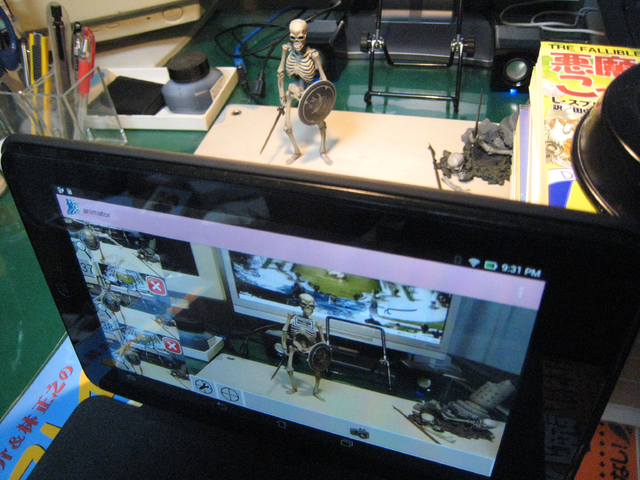
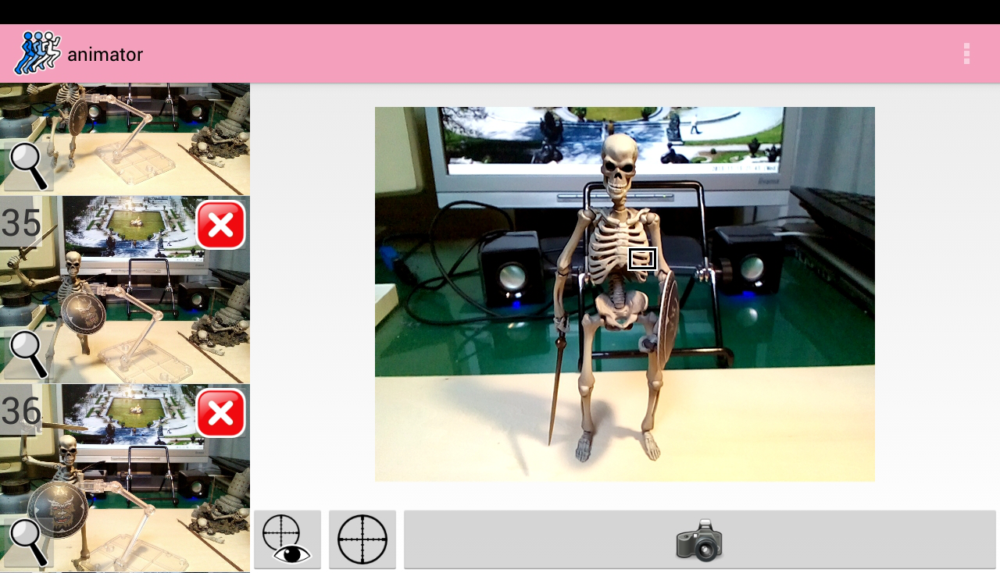

animator
********

.. image:: icon.png

.. contents:: Table of contents

Overview
========

animator is an Android application to make stop motion movie.

Screenshots
===========

Example movie
=============

One example movie made by this application has been uploaded to `YouTube`_.

.. _YouTube: http://www.youtube.com/watch?v=b0Ogk506ELw

Supported tablet
================

I tested this application with Acer A500 (10inch tablet).

Google play
===========

This application is available at `Google play`_.

.. _Google play: https://play.google.com/store/apps/details?id=jp.gr.java_conf.neko_daisuki.android.animator

How to use
==========

Install nexec client for Android
--------------------------------

This application uses `nexec`_ to generate a movie. Please install
`nexec client for Android`_ before using.

.. _nexec: http://neko-daisuki.ddo.jp/~SumiTomohiko/nexec/index.html
.. _nexec client for Android: https://play.google.com/store/apps/details?id=jp.gr.java_conf.neko_daisuki.android.nexec.client

Shot and "Make movie"
---------------------

Photos which you shot are added to the list at bottom. When you finished, select
"Make movie" menu to make a movie. When finished, you see the "Finished."
message.

Watch your movie
----------------

Your movie will be at /sdcard/.animator/project_name/movie.mp4. Please open this
with your filer.

Problems
========

Both of the current version of this application and `fsyscall`_/`nexec`_ are
**ULTRA** toy. These include many problems (which will be fixed in the future).

.. _fsyscall: http://neko-daisuki.ddo.jp/~SumiTomohiko/fsyscall/index.html

fsyscall is very slow.
----------------------

fsyscall is very slow. The example movie was generated from about 20 jpeg files.
Generating the movie took about one minute (A usual desktop machine can do it in
a few seconds).

I recommend you to try only with two or three pictures at first to know how slow
fsyscall is.

fsyscall is not stable.
-----------------------

fsyscall can crash easily. To avoid long time server down, the default nexec
server (neko-daisuki.ddo.jp) reboots in every 15 minutes. The server informs its
status in `Twitter`_.

.. _Twitter: https://twitter.com/info_neko_daisu

Cannot remove one frame only.
-----------------------------

Removing a frame has not been implemented yet. If you failed to shot a photo,
please do "Clear project" to delete all of the project, and redo all. Please do
not get angry.

Frame rate is fixed to eight.
-----------------------------

Frame rate is always eight (eight frames per one second).

Stop nexec client if it does not connect with a server.
-------------------------------------------------------

When you order "Make movie", nexec client connects with a server and executes a
command. Usually, nexec client shows logs in logcat like (You can read system
call requests and responses in this)::

    07-16 04:32:52.620  1199  1212 D nexec client: SyscallInputStream: numeric representation of the command is 46.
    07-16 04:32:52.620  1199  1212 D nexec client: SyscallInputStream: command is CALL_WRITE.
    07-16 04:32:52.650  1199  1212 D nexec client: SlaveHub: command received: command=CALL_WRITE, pid=1826
    07-16 04:32:52.650  1199  1212 D nexec client: SlaveHub: from the master to the slave: command=CALL_WRITE, payloadSize=3
    07-16 04:32:52.650  1199  1212 V nexec client: SlaveHub: works of the slave hub were finished.
    07-16 04:32:52.650  1199  1212 V nexec client: Slave: performing the work.
    07-16 04:32:52.660  1199  1212 D nexec client: SyscallInputStream: numeric representation of the command is 46.
    07-16 04:32:52.660  1199  1212 D nexec client: SyscallInputStream: command is CALL_WRITE.
    07-16 04:32:52.660  1199  1212 D nexec client: SlaveHelper: read command: CALL_WRITE
    07-16 04:32:52.660  1199  1212 I nexec client: Slave: write(fd=2, buf, nbytes=1)
    07-16 04:32:52.660  1199  1212 I nexec client: SlaveHelper: result (generic64): retval=1
    07-16 04:32:52.660  1199  1212 V nexec client: Slave: finished the work.
    07-16 04:32:52.660  1199  1212 V nexec client: SlaveHub: works of the slave hub are being processed.
    07-16 04:32:52.660  1199  1212 V nexec client: SlaveHub: the work for the slave is being processed.
    07-16 04:32:52.660  1199  1212 D nexec client: SyscallInputStream: numeric representation of the command is 47.
    07-16 04:32:52.660  1199  1212 D nexec client: SyscallInputStream: command is RET_WRITE.
    07-16 04:32:52.670  1199  1212 D nexec client: SlaveHub: from the slave to the master: command=RET_WRITE, payloadSize=1
    07-16 04:32:52.670  1199  1212 V nexec client: SlaveHub: the work for the slave was finished.
    07-16 04:32:52.670  1199  1212 V nexec client: SlaveHub: works of the slave hub were finished.
    07-16 04:32:52.770  1199  1212 V nexec client: SlaveHub: works of the slave hub are being processed.
    07-16 04:32:52.770  1199  1212 V nexec client: SlaveHub: the work for the master hub is being processed.
    07-16 04:32:52.770  1199  1212 D nexec client: SyscallInputStream: numeric representation of the command is 46.
    07-16 04:32:52.770  1199  1212 D nexec client: SyscallInputStream: command is CALL_WRITE.
    07-16 04:32:52.810  1199  1212 D nexec client: SlaveHub: command received: command=CALL_WRITE, pid=1826
    07-16 04:32:52.810  1199  1212 D nexec client: SlaveHub: from the master to the slave: command=CALL_WRITE, payloadSize=34
    07-16 04:32:52.810  1199  1212 V nexec client: SlaveHub: works of the slave hub were finished.
    07-16 04:32:52.820  1199  1212 V nexec client: Slave: performing the work.
    07-16 04:32:52.820  1199  1212 D nexec client: SyscallInputStream: numeric representation of the command is 46.
    07-16 04:32:52.820  1199  1212 D nexec client: SyscallInputStream: command is CALL_WRITE.
    07-16 04:32:52.820  1199  1212 D nexec client: SlaveHelper: read command: CALL_WRITE
    07-16 04:32:52.820  1199  1212 I nexec client: Slave: write(fd=2, buf, nbytes=32)
    07-16 04:32:52.820  1199  1212 I nexec client: SlaveHelper: result (generic64): retval=32
    07-16 04:32:52.820  1199  1212 V nexec client: Slave: finished the work.
    07-16 04:32:52.820  1199  1212 V nexec client: SlaveHub: works of the slave hub are being processed.
    07-16 04:32:52.820  1199  1212 V nexec client: SlaveHub: the work for the slave is being processed.
    07-16 04:32:52.820  1199  1212 D nexec client: SyscallInputStream: numeric representation of the command is 47.
    07-16 04:32:52.820  1199  1212 D nexec client: SyscallInputStream: command is RET_WRITE.
    07-16 04:32:52.820  1199  1212 D nexec client: SlaveHub: from the slave to the master: command=RET_WRITE, payloadSize=1
    07-16 04:32:52.820  1199  1212 V nexec client: SlaveHub: the work for the slave was finished.
    07-16 04:32:52.820  1199  1212 V nexec client: SlaveHub: works of the slave hub were finished.
    07-16 04:32:52.940  1199  1212 V nexec client: SlaveHub: works of the slave hub are being processed.
    07-16 04:32:52.940  1199  1212 V nexec client: SlaveHub: the work for the master hub is being processed.
    07-16 04:32:52.940  1199  1212 D nexec client: SyscallInputStream: numeric representation of the command is 60.
    07-16 04:32:52.940  1199  1212 D nexec client: SyscallInputStream: command is CALL_SELECT.
    07-16 04:32:52.970  1199  1212 D nexec client: SlaveHub: command received: command=CALL_SELECT, pid=1826
    07-16 04:32:52.970  1199  1212 D nexec client: SlaveHub: from the master to the slave: command=CALL_SELECT, payloadSize=8
    07-16 04:32:52.970  1199  1212 V nexec client: SlaveHub: works of the slave hub were finished.
    07-16 04:32:52.970  1199  1212 V nexec client: Slave: performing the work.
    07-16 04:32:52.970  1199  1212 D nexec client: SyscallInputStream: numeric representation of the command is 60.
    07-16 04:32:52.970  1199  1212 D nexec client: SyscallInputStream: command is CALL_SELECT.
    07-16 04:32:52.970  1199  1212 D nexec client: SlaveHelper: read command: CALL_SELECT
    07-16 04:32:52.970  1199  1212 I nexec client: Slave: select(nfds=1, in, ou, ex, timeout)
    07-16 04:32:52.980  1199  1212 I nexec client: SlaveHelper: result (select): retval=0
    07-16 04:32:52.980  1199  1212 V nexec client: Slave: finished the work.
    07-16 04:32:52.980  1199  1212 V nexec client: SlaveHub: works of the slave hub are being processed.
    07-16 04:32:52.980  1199  1212 V nexec client: SlaveHub: the work for the slave is being processed.
    07-16 04:32:52.980  1199  1212 D nexec client: SyscallInputStream: numeric representation of the command is 61.
    07-16 04:32:52.980  1199  1212 D nexec client: SyscallInputStream: command is RET_SELECT.
    07-16 04:32:52.980  1199  1212 D nexec client: SlaveHub: from the slave to the master: command=RET_SELECT, payloadSize=1
    07-16 04:32:52.980  1199  1212 V nexec client: SlaveHub: the work for the slave was finished.
    07-16 04:32:52.980  1199  1212 V nexec client: SlaveHub: works of the slave hub were finished.
    07-16 04:32:53.450  1199  1212 V nexec client: SlaveHub: works of the slave hub are being processed.
    07-16 04:32:53.450  1199  1212 V nexec client: SlaveHub: the work for the master hub is being processed.

But sometimes you can not see it. In this case, I am guessing that the problem
is in `nexec client for Android`_ which does not finish the service correctly.
To recover from this phenomenon, stopping `nexec client for Android`_ may be
usable with the following steps.

1. Select "Apps" in the desktop
2. Select "Settings"
3. Select "Applications"
4. Select "Running services"

.. image:: running_services.png

5. Select "All" tab
6. Select "nexec client"

.. image:: nexec_client.png

7. Push "Force stop" and "OK"

.. image:: force_stop.png
.. image:: force_stop_dialog.png

Anything else
=============

License
-------

This application is under `the MIT license`_.

.. _the MIT license:
    https://github.com/SumiTomohiko/animator/blob/master/COPYING.rst#mit-license

GitHub repository
-----------------

Source code of this application is hosted in `GitHub`_.

.. _GitHub: https://github.com/SumiTomohiko/animator

Author
------

The author of this is `Tomohiko Sumi`_.

.. _Tomohiko Sumi: http://neko-daisuki.ddo.jp/~SumiTomohiko/index.html

.. vim: tabstop=4 shiftwidth=4 expandtab softtabstop=4 filetype=rst
